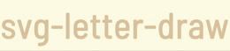

# SVG Letter Draw

A React component to animate text with SVG letter drawing using Framer Motion and opentype.js. Easily customize fonts, colors, stroke widths, animation timings, and fill effects.




## Features

- Animated SVG letter drawing with smooth, customizable transitions.
- Support for custom fonts via opentype.js.
- Configurable stroke and fill colors (accepts both single values and arrays).
- Two fill animation styles: fade (default) and draw (line-drawing effect).
- Adjustable letter spacing, animation duration, delay, and stroke width.
- Responsive design: scales with the container.

## Installation

Install via npm:

```bash
npm install svg-letter-draw
