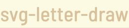
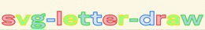

<div align="center">
  <h1>svg-letter-draw</h1>
  <a href="https://www.npmjs.com/package/svg-letter-draw"></a>
  <a href="https://github.com/expwr/svg-letter-draw/blob/main/LICENSE"></a>
  <br /><br />
</div>

A React component to animate text with SVG letter drawing using Framer Motion and opentype.js. Easily customize fonts, colors, stroke widths, animation timings, and fill effects.




## Features

- Animated SVG letter drawing with smooth, customizable transitions.
- Support for custom fonts via opentype.js.
- Configurable stroke and fill colors (accepts both single values and arrays).
- Two fill animation styles: fade (default) and draw (line-drawing effect).
- Adjustable letter spacing, animation duration, delay, and stroke width.
- Responsive design: scales with the container.

## Installation

Install via npm:

```bash
npm install svg-letter-draw
